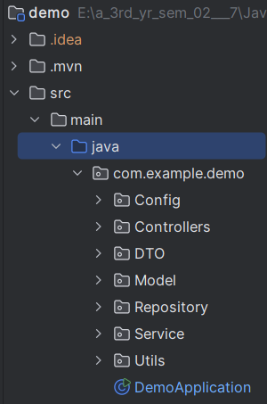
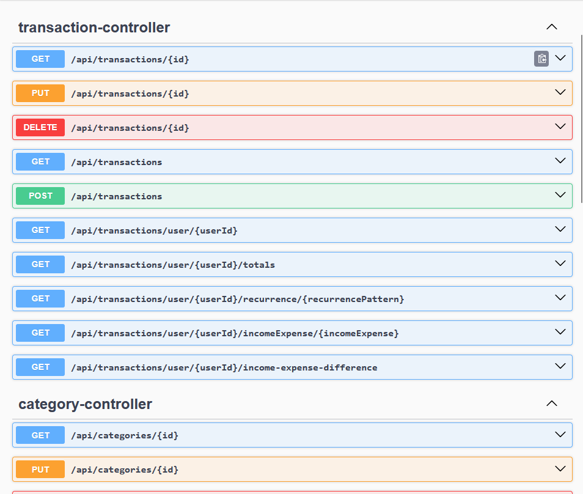
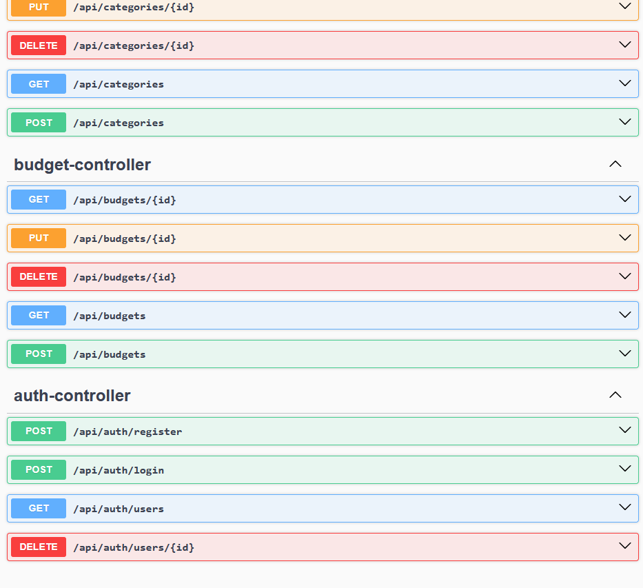
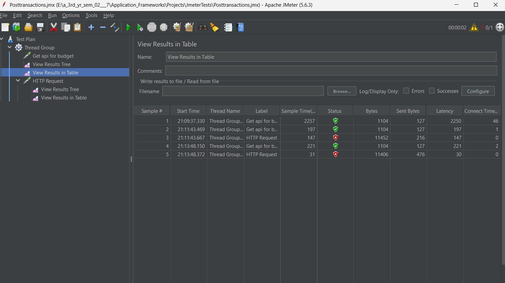

📊 Finance Tracker REST API
A Spring Boot-based financial management system built using IntelliJ IDEA, with JWT authentication, MongoDB, and a well-structured microservices approach.

🚀 Introduction
This project is a Finance Tracker application where users can manage their transactions, set budgets, categorize expenses, and generate financial reports.

Built using Spring Boot (IntelliJ IDEA)
Database: MongoDB (MongoDB Compass for visualization)
Authentication: JWT (Users must have a valid token to access API endpoints)
API Testing: Swagger & Postman
Unit Testing: JUnit 5 & Mockito (mocking data)
Integration Testing: Docker Desktop & Testcontainers
Performance Testing: JMeter
Security Testing: OWASP ZAP
🛠 How to Run the Application
1️⃣ Open the project in IntelliJ IDEA
2️⃣ Run the application:

Navigate to src/main/java/com/example/demo/DemoApplication.java
Right-click and select Run 'DemoApplication'
3️⃣ The application will start on http://localhost:8080
🗄 Database - MongoDB
The application uses MongoDB as the NoSQL database.
Use MongoDB Compass to visualize and interact with stored data.
📂 Folder Architecture
The project follows a layered architecture:

📁 src/main/java/com/example/demo

🔹 config/ → Configuration files (Security, JWT, CORS)
🔹 controllers/ → REST API Controllers
🔹 service/ → Business logic
🔹 repository/ → Database interactions (MongoDB)
🔹 dto/ → Data Transfer Objects (DTOs)
🔹 model/ → Entity models (Transactions, Budget, User, etc.)
🔹 utils/ → Utility classes
🔹 validations/ → Added for every entity
🔑 Authentication & Security (JWT)
JWT Token is generated upon login and must be included in every request.
Without a valid token, access to API endpoints is denied.
🔍 API Documentation
📄 Swagger UI:
🔗 http://localhost:8080/swagger-ui/index.html

📄 OpenAPI Docs:
🔗 http://localhost:8080/v3/api-docs

📌 API Features
Users: Register & Login
Transactions: Add, Update, Delete, View by User ID
Budgets: Set & Compare with actual income/expenses
Categories: Categorize transactions
Admin Features: View & manage all data, generate reports: Compare budgeted vs actual income & expenses

📦 Dependencies Used
✔ Spring Boot Starter Web (REST API)
✔ Spring Boot Starter Data MongoDB (Database)
✔ Spring Security (Authentication & Authorization)
✔ JWT (Java Web Token) (Token-based authentication)
✔ Lombok (Reduces boilerplate code)
✔ Spring Boot Validation (Data validation)
✔ Spring Boot Starter Test (Testing framework)
✔ Mockito (Mocking for unit tests)
✔ JUnit 5 (Testing)
✔ Swagger-UI (API documentation)
✔ Testcontainers (For integration testing with Docker)
✔ JMeter (Performance testing)
✔ OWASP ZAP (Security testing)

❗ Troubleshooting Port 8080 Issues
If port 8080 is busy:
1️⃣ Open Command Prompt as Administrator
2️⃣ Run the following command to find the process using port 8080:

netstat -ano | findstr :8080
3️⃣ Identify the PID (Process ID) in the last column
4️⃣ Kill the process using:

task kill /PID <PID> /F
(Replace <PID> with the actual process ID)

This issue happened to me many times, so I always keep this solution handy.

✨ Have a Great Day! 🚀
Hope this helps! Let me know if you need any improvements. 😊